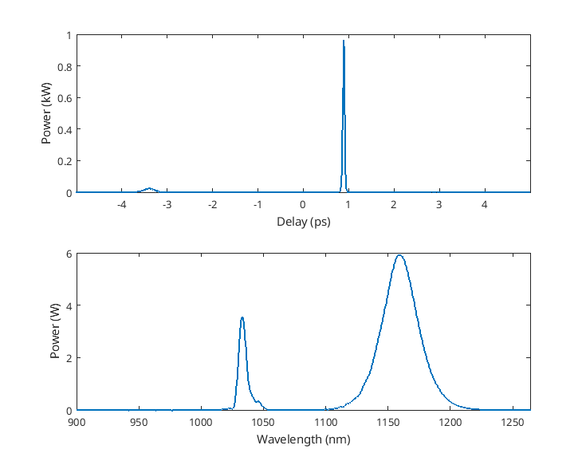

# Generalised Nonlinear Schrödinger Equation solver for nonlinear optical pulse propagation in optical fibers
This solver is based on the Runge-Kutta 4 in interaction picture algorithm described in [1] for solving the following nonlinear Schrödinger equation [2] : 

$${{\partial A(z,T)} \over {\partial z}} = -{{\alpha(\omega)}\over{2}} A(z,T) +\sum_{k \geq 2}{{{i^{k+1}}\over{k!}}\beta_{k}{{\partial^{k}A(z,T)}\over{\partial T^{k}}}} +...$$

$$... i\gamma\Bigg(1+\tau_{shock}{{\partial}\over{\partial T}}\Bigg)\times \Bigg(A(z,T){\int}_{-\infty}^{\infty}{R(T')\vert A(z,T-T')\vert^{2}dT'}\Bigg)\ \ \ \ \ \ \ \ \ \ \textbf{(1)}$$

This solver was developped for my PhD [thesis](https://cnrs.hal.science/tel-04901112/)
## Basic usage
Try to run in the Matlab prompt : 
```Matlab
example
```
This script runs the simplest implementation of the solver. Let's study the first section : 
```Matlab
c = 299792458;
Tspan = 4e-12;
lambda_low = 900e-9;
lambda_high = 1300e-9;
l0 = 1040e-9;
f0 = c./l0;
[t, dt, f, df, w, lbd, res, lambda_low, lambda_high] = initGNLSE(Tspan, l0, lambda_low, lambda_high);
wshift = fftshift(w);
tol = 1e-7;
```
This section is creating the usefull axes & values for the simulation, through the `initGNLSE()` function. Also, we need to define some physical values, such as half duration of the time window, the lowest & the highest wavelength of the simulation, the central frequency of the simulation, and the solver tolerance which is set here to 1.10 $^{-7}$ .

```Matlab
alpha = 0;
betas = [-3.53571099317077e-26, 3.68095336905838e-41,2.0172694409917e-55...
         ,-1.31835263681886e-69];
gamma = 0.0742400655658342;
L = 1;
h = L/1000;
fR = 0.18;
```
The next section is defining the optical fibers via 5 parameters : 

* alpha is setting the confinement losses of the fiber, in m $^{-1}$.
* betas is a vector containing the Taylor coefficients of the propagation constant in the fiber, in s $^{n}$.m $^{-1}$ , n $\geq$ 2
* gamma is the nonlinear coefficient of the fiber, in W $^{-1}$.m $^{-1}$. It could also be a vector containing $\gamma(\lambda)$
* L is the fiber length, in m
* *h* is the initial integration stepsize
* fR is the fractionnal Raman response of the fiber. If set to 0, the solver will compute the propagation without considering the Raman response. Typically, $f_R = 0.18$ in fused silica [2].

In the next section, we are defining the input optical pulse : 
```Matlab
N = 2;
tFWHM_p = 100e-15;
t0_p = tFWHM_p/2/sqrt(log(2));
l1 = l0;
f_p = c/l1;
tshift = -3e-12;
P_p = (N^2*abs(betas(1)))./(t0_p^2*gamma);
Epump = sechPulse(P_p,0,t0_p,f_p,tshift,t,f,f0);
```
The pulse is here defined as a 2<sup>nd</sup> order soliton, using the soliton area theorem. $l1$ is defining the central wavelength of the pulse, which is the same here as the central wavelength of the simulation. We also need to compute the corresponding frequency, i.e $f_p$ We can add a temporal shift of the maximum of the pulse. The complex envelop of the pulse is then defined using `sechPulse()` as : 

$$ A(z=0,t) = \sqrt{P} \text{ sech}\Bigg({{t-t_{shift}}\over{t_0}} \Bigg) {\exp}\Bigg({i\Big({{C_2}\over{2}}(\omega-\omega_0)^2\Big)-\omega_0 t} \Bigg)\ \ \ \ \ \ \ \ \ \ \textbf{(2)} $$

We can see here that it's possible to add another parameter, called $C_2$ which is corresponding to the second order taylor coefficient of the spectral phase of the pulse. This parameter allow the pulse to be chirped.

Since the physical parameters are defined, we can now focus on the numerical simulation. You can run the simulation by calling the function `propagationFibre()`
```Matlab
Eout = propagationFibre(Epump,L,h,l0,l1,tol,t,f,lbd,alpha,betas,gamma,...
    fR, 'Propagation example');
singlePlot(Eout, t, lbd, lambda_low, lambda_high, 'linear')
```
And plot the result with the `singlePlot()` function : 



## Solver description
As mentionned before, this solver is based on the Runge-Kutta 4 algorithm for solving ODEs. To use this algortihm on eq. **(1)**, we need to do some maths : 

First, let's rewrite eq. **(1)** as : 

$$ {{\partial A(z,T)} \over {\partial z}} = \Big(\widehat{L} + \widehat{N}\Big) A(z,T)\ \ \ \ \ \ \ \ \ \  \textbf{(3)}$$

Where $\widehat{L}$ stands for the linear part of eq. **(1)**, i.e group velocity dispersion and linear losses operator and $\widehat{N}$ stands for the nonlinear part.

$$\widehat{L} = -{{\alpha(\omega)}\over{2}} +\sum_{k \geq 2}{{{i^{k+1}}\over{k!}}\beta_{k}{{\partial^{k}}\over{\partial T^{k}}}}\ \ \ \ \ \ \ \ \ \  \textbf{(4)}$$

$$\widehat{N} = i\gamma\Bigg(1+\tau_{shock}{{\partial}\over{\partial T}}\Bigg)\times\Bigg({\int}_{-\infty}^{\infty}{R(T')\vert A(z,T-T')\vert^{2}dT'}\Bigg)\ \ \ \ \ \ \ \ \ \ \textbf{(5)}$$

Now let's define : 

$$ A_{I}(z,T) = {\exp}({{(z-z')}\widehat{L}})A(z,T)\ \ \ \ \ \ \ \ \ \ \textbf{(6)}$$

Applied to eq. **(2)** : 

$$ {{\partial A_{I}(z,T)}\over{\partial z}} = \widehat{N_{I}} A_{I}(z,T) \ \ \ \ \ \ \ \ \ \ \textbf{(7)}$$ 

$$ \widehat{N}_{I} = {\exp}({{-(z-z')}\widehat{L}})\widehat{N} {\exp}({{(z-z')}\widehat{L}}) \ \ \ \ \ \ \ \ \ \ \textbf{(8)}$$

So, by setting $z' = z+{h\over 2}$, it's easy to integrate eq. **(7)** using standard integration algorithms.

## Integration of the rate equations for Yb-doped fibers

A version of the solver is implemented along with the rate equations for Yb-doped fibers. It is based on the algorithm proposed by Stoliarov *et al.* [6]. The solver computes the gain over the spectral window at each integration step. The gain is evaluated from : 

$$ g(z,\omega) = [\sigma^{a}(\omega) + \sigma^{e}(\omega)] n_{2}(z) - \sigma^{a} N_{Yb}\ \ \ \ \ \ \ \ \ \ \textbf{(9)} $$

$$ n_2(z) = N_{Yb}{{{{\sigma_{p}^{a}\Gamma_{p}}\over{\hbar \omega}} P_{p}(z) + f_{rep} \int{{{\sigma^{a}(\omega)\rho(\omega)}\over{\hbar \omega}}d\omega}}\over{{{{(\sigma_{p}^{a}+\sigma_{p}^{e})\Gamma_{p}}\over{\hbar \omega}} P_{p}(z) + f_{rep} \int{{{(\sigma^{a}(\omega)+\sigma^{e}(\omega))\rho(\omega)}\over{\hbar \omega}}d\omega}+{{A_{eff}}\over{\tau}}}}}\ \ \ \ \ \ \ \ \ \ \textbf{(10)} $$

$$ {{dP_{p}(z)}\over{dz}} = [(\sigma_{p}^{a} + \sigma_{p}^{e})n_{2}(z) - \sigma_{p}^{a}N_{Yb})]\Gamma_{p} P_{p}(z) - \alpha(\omega_{p})P_{p}(z)\ \ \ \ \ \ \ \ \ \ \textbf{(11)} $$

The solver for the gain integrated algorithm can be called with the `propagationFibreGain()` function, and an example of its implementation can be found in the `GMN_Stoliarov` script
## List of functions

## - adaptiveSolver.m
Usage : 
```Matlab
[Eout, temp_rad, spec_rad] = adaptiveSolver(E, L, h, alpha, betas, gamma, fR,...
                           hR_w, tau_shock, t, lbd, wshift, tol, FiberName)
```
Description :

This function computes the complex envelop of an optical pulse after its propagation in a given optical fiber by solving eq. **(1)**. This solver is based on a RK4IP algorithm, and is using an intelligent adaptative stepsize from [3].

Inputs : 

* E : Complex envelop of the input optical pulse
* L : Length of the fiber [m]
* h : Initial stepsize [m]
* alpha : Confinement losses of the fiber [m $^{-1}$]
* betas : Taylor coefficients of the propagation constant [s $^{n}$.m $^{-1}$,  n $\geq$ 2]
* gamma : Nonlinear coefficient of the fiber [W $^{-1}$.m $^{-1}$]
* fR : Fractionnal Raman response. Raman scattering is neglected if set to 0
* hR_w : Raman scattering response of the propagation medium
* tau_shock : Shock time for self-steepening [s]
* lbd : Wavelength vector of the simulation [m]
* wshift : Fourier shift of the simulation angular frequency vector [rad.s $^{-1}$]
* tol : Maximum tolerance for the adaptative stepsize
* FiberName : Name of the fiber

Outputs : 

* Eout : Complex envelop of the pulse after the fiber
* temp_rad : Duration evolution of the pulse during the propagation [s]
* spec_rad : Spectral width evolution of the pulse during the propagation [m]

## - adaptiveSolverGain.m
Usage : 
```Matlab
 [Eout, temp_rad, spec_rad, Pump_out] = adaptativeSolverGain(E, L, h, alpha, betas, gamma, fR,...
                                        hR_w, tau_shock, t, lbd, wshift, tol, frep, Pp, lbd_p,...
                                        sigma_a, sigma_e, sigma_ap, sigma_ep, N_ions, r_core,...
                                        Gamma_P, ww0, FiberName)
```
Description : This function computes the complex envelop of an optical pulse after its propagation in a given Yb-doped fiber.

Inputs : 

* E : Complex envelop of the input optical pulse
* L : Length of the fiber [m]
* h : Initial stepsize [m]
* alpha : Confinement losses of the fiber [m $^{-1}$]
* betas : Taylor coefficients of the propagation constant [s $^{n}$.m $^{-1}$,  n $\geq$ 2]
* gamma : Nonlinear coefficient of the fiber [W $^{-1}$.m $^{-1}$]
* fR : Fractionnal Raman response. Raman scattering is neglected if set to 0
* hR_w : Raman scattering response of the propagation medium
* tau_shock : Shock time for self-steepening [s]
* lbd : Wavelength vector of the simulation [m]
* wshift : Fourier shift of the simulation angular frequency vector [rad.s $^{-1}$]
* tol : Maximum tolerance for the adaptative stepsize
* frep : Repetition rate of the input laser [Hz]
* Pp : Input pump power [W]
* lbd_p : Pump wavelength [m]
* sigma_a : absorption cross sections over the spectral window of the simulation [m $^{2}$]
* sigma_e : emission cross sections over the spectral window of the simulation [m $^{2}$]
* sigma_ap : absorption cross section at the pump wavelength [m $^{2}$]
* sigma_ep : emission cross section at the pump wavelength [m $^{2}$]
* N_ions : Number of Yb ions in the glass matrix [m $^{-3}$]
* r_core : radius of the fiber core
* Gamma_P : overlap of the pump mode and the core of the fiber
* ww0 : vector of angular frequency [rad.s $^{-1}$]
* FiberName : Name of the fiber

Outputs : 

* Eout : Complex envelop of the pulse after the fiber
* temp_rad : Duration evolution of the pulse during the propagation [s]
* spec_rad : Spectral width evolution of the pulse during the propagation [m]
* Pump_out : Residual pump power at the output of the fiber

## - autocoTrace.m
Usage : 
```Matlab
AC = autocoTrace(E)
```

Description : 

This function computes the autocorrelation function of an optical pulse.

Inputs : 

* E : Complex envelop of the input optical pulse OR Intensity envelop of the input optical pulse

Outputs : 

* AC : Normalized intensity profile of the autocorrelation trace.

## - centerPulse.m
Usage : 
```Matlab
Ecenter = centerPulse(E,t)
```

Description :

This function center the input pulse in the temporal domain

Inputs : 

* E : Complex envelop of the input pulse
* t : time vector [s]

Output : 

* Ecenter : complex envelop of the centered pulse

## - compressPulse.m
Usage : 
```Matlab
[Ecomp, Ltot, Dtot] = compressPulse(E, t, f, l0, lc, betas_init, Linit)
```

Description : 

This function calculates the best compressor parameters to minimize the autocorrelation trace width of the input optical field. Initial propagation stepsize & dispersion coefficients must be well guessed in order to reduce the compuation time and to improve the accuracy.

Inputs : 

* E : Complex envelop of the optical pulse to compress
* t : Time vector of the simulation [s]
* f : Frequency vector of the simulation [Hz]
* l0 : Central wavelength of the simulation [m]
* lc : Central wavelength of the pulse to compress [m]
* betas_init : Dispersion coefficients [s $^{n}$.m $^{-1}$,  n $\geq$ 2]
* Linit : Initial stepsize for the linear propagation [m]
  
Outputs : 

* Ecomp : Complex envelop of the compressed pulse
* Ltot : Total length through the dispersive elements
* Dtot : Total dispersion coefficients for the compressor [s $^{n}$, n $\geq$ 2]

## - dummyCrossYb.m
Usage : 
```Matlab
[sig_a, sig_e] = dummyCrossYb(lbd)
```

Description : 

This function computes the absorption and emission cross sections of a dummy yb-doped fiber over the given spectral window.

Input : 

* lbd : wavelength vector [m]

Outputs : 

* sig_a : absorption cross section [m $^{2}$]
* sig_e : emission cross section [m $^{2}$]

## - gaussianPulse.m
Usage : 
```Matlab
E = gaussianPulse(P,C2,t0,f1,t_shift,t,f, f0)
```

Description :

This function creates the complex envelop vector of a gaussian optical pulse. An amplitude noise of one photon per spectral node is added, based on the following : 

$$A_{noise}(t) = \mathcal{F}^{-1}\Bigg[({T_{max}\hbar \omega})^{1/2} {\exp}(-i\psi(\omega_n))\Bigg] (t) \ \ \ \ \ \ \ \ \ \ \textbf{(12)}$$ 

where $\psi(\omega_n)$ follows a normal distribution.

Inputs : 

* P : Peak power of the Fourier transform limited pulse [W]
* C2 : Second order coefficient of the Taylor developpment of the spectral phase [s $^{2}$]
* t0 : 1/e half pulse duration [s]
* f1 : Optical center frequency [Hz]
* t_shift : Temporal shift of the pulse [s]
* t : Simulation time vector [s]
* f : Simulation frequency vector [Hz]
* f0 : Simulation central frequency [Hz]

Outputs :

* E : Complex envelop of the optical pulse

## - gaussRadius.m
Usage : 
```Matlab
radius = gaussRadius(x, y, type)
```

Description : 

This function evaluate the radius of a gaussian function.

Inputs : 

* x : x-axis datas
* y : y-axis datas
* type : string defining the radius (`'1/e'`, `'1/e2'`, `'FWHM'`)

Outpus : 

* radius : Evaluated radius [x-units]

## - GratingCompressor.m
Usage : 
```matlab
[betas] = GratingCompressor(N, theta_i, lbd)
```

Description : 

This function computes the 2nd, 3rd and 4th orders of dispersion of a Treacy compressor

Inputs : 

* N : grating density [lines.mm $^{-1}$]
* theta_i : incidence angle of the beam. Must be contained between the Littrow angle and 90°  [°]
* lbd : Central wavelength of the input pulse [m]

Output : 
* betas : vector containing the dispersion parameters [s $^{n}$.m $^{-1}$, 2 $\leq$ n $\leq$ 4]

## - initGNLSE.m
Usage : 
```Matlab
[t, dt, f, df, w, lbd, res, lambda_low, lambda_high] = initGNLSE(Tspan, l0, lambda_low, lambda_high)
```

Description : 

Initialize the global values & vectors for the simulation.

Inputs : 

* Tspan : Half width of the temporal window [s]
* l0 : Central wavelength of the simulation [m]
* lambda_low : Lowest wavelength of the simulation [m]

Outputs : 

* t : Created time vector [s]
* dt : Time resolution [s]
* f : Created frequency vector [Hz]
* df : Frequency resolution [Hz]
* w : Created angular frequency vector [rad.s $^{-1}$]
* lbd : Created wavelength vector [m]
* res : Size of the vectors

## - linearProp.m
Usage : 
```Matlab
TE = linearProp(E, f, l0, lc, betas, L)
```

Description : 

Performs the linear propagation of an optical pulse through a dispersive fiber

Inputs : 

* E : Complex envelop of the input optical pulse
* f : Frequency vector of the simulation [Hz]
* l0 : Central wavelength of the simulation [m]
* lc : Central wavelength of the optical pulse [m]
* betas : Dispersion coefficients [s $^{n}$.m $^{-1}$,  n $\geq$ 2]
* L : Length of the fiber [m]

Outputs : 

* TE : Complex envelop of the output optical pulse

## - n2yb.m
Usage : 
```Matlab
n_up = n2yb(ww0, rho_w, sigma_a, sigma_e, lbd_p, Pp, Gamma_P, frep, rcore, N_ions)
```

Description : This function computes the population of ions in the excited state for a given pump power and signal input.

Inputs : 

* ww0 : vector of angular frequency [rad.s $^{-1}$]
* rho_w : spectral power density of the signal over the spectral window
* sigma_a : absorption cross sections over the spectral window of the simulation [m $^{2}$]
* sigma_e : emission cross sections over the spectral window of the simulation [m $^{2}$]
* lbd_p : Pump wavelength [m]
* Pp : Input pump power [W]
* Gamma_P : overlap of the pump mode and the core of the fiber
* frep : Repetition rate of the input laser [Hz]
* r_core : radius of the fiber core
* N_ions : Number of Yb ions in the glass matrix [m $^{-3}$]

Output : 

* n_up : ion population on the excited state

## - nonlinearStep.m
Usage : 
```Matlab
k = nonlinearStep(E, h, gamma, tau_shock, wshift)
```

Description : 

Nonlinear quarter-step for the RK4IP algorithm without Raman scattering (i.e $f_R = 0$).

Inputs : 

* E : Complex envelop of the input optical pulse
* h : propagation stepsize [m]
* gamma : Nonlinear coefficient of the fiber [W $^{-1}$.m $^{-1}$]
* tau_shock : Shock time for self-steepening [s]
* wshift : Fourier shift of the simulation angular frequency vector [rad.s $^{-1}$]

Outpus : 

* k : Nonlinear quarter-step operator

## - nonlinearStepFull.m
Usage : 
```Matlab
k = nonlinearStepFull(E, h, fR, hR_w, gamma, tau_shock, wshift)
```

Description : 

Nonlinear quarter-step for RK4IP algorithm including Raman scattering.

Inputs : 

* E : Complex envelop of the input optical pulse
* h : propagation stepsize [m]
* fR : Fractionnal Raman response of the propagation medium (typ. 0.18 in fused silica) []
* hR_w : Raman scattering response of the fiber in frequency domain
* gamma : Nonlinear coefficient of the fiber [W $^{-1}$.m $^{-1}$]
* tau_shock : Shock time for self-steepening [s]
* wshift : Fourier shift of the simulation angular frequency vector [rad.s $^{-1}$]

Outpus : 

* k : Nonlinear quarter-step operator

## - propagationFibre.m
Usage : 
```Matlab
[Eout, temp_rad, spec_rad] = propagationFibre(E, L, h, l0, lc, tol ,t, f, lbd, alpha, betas, gamma, fR, FiberName)
```

Description : 


This function computes the propagation over a specific distance of an optical fiber.


INPUTS : 

* E : Complex envelop of the input electrical field
* L : Length of the optical fiber [m]
* h : Propagation initial stepsize [m]
* l0 : Central vacuum wavelength of the simulation [m]
* lc : Central vacuum wavelength of the input optical field [m]
* tol : Relative tolerance of the simulation []
* t : Simulation time vector [s]
* f : Simulation frequency vector [Hz]
* lbd : Simulation wavelength vector [m]
* alpha : Confinement losses of the fiber [m $^{-1}$]
* betas : Taylor coefficients of the propagation constant at the given central wavelength [s $^{n}$.m $^{-1}$,  n $\geq$ 2]
* gamma : Nonlinear coefficient of the fiber [W $^{-1}$.m $^{-1}$]
* fR : Fractionnal Raman response of the propagation medium (0.18 in fused silica). Set to zero to exclude Raman scattering []
* FiberName : String to display while computing

OUTPUTS :

* Eout : Complex envelop of the output optical field
* temp_rad : pulse duration evolution during the propagation [s]
* spec_rad : Pulse spectral width evolution during the propagation [m]

## - propagationFibreGain.m
Usage : 
```Matlab
[Eout, temp_rad, spec_rad, Pump_out] = propagationFibreGain(E, L, h, l0, lc, tol ,t, f, lbd, alpha, betas, gamma, fR,frep, Pp, lbd_p, sigma_a,...
            sigma_e, sigma_ap, sigma_ep, N_ions, r_core,Gamma_P, FiberName)
```

Description :

This function computes the propagation over a specific distance of a yb-doped fiber

Inputs : 

* E : Complex envelop of the input electrical field
* L : Length of the optical fiber [m]
* h : Propagation initial stepsize [m]
* l0 : Central vacuum wavelength of the simulation [m]
* lc : Central vacuum wavelength of the input optical field [m]
* tol : Relative tolerance of the simulation []
* t : Simulation time vector [s]
* f : Simulation frequency vector [Hz]
* lbd : Simulation wavelength vector [m]
* alpha : Confinement losses of the fiber [m $^{-1}$]
* betas : Taylor coefficients of the propagation constant at the given central wavelength [s $^{n}$.m $^{-1}$,  n $\geq$ 2]
* gamma : Nonlinear coefficient of the fiber [W $^{-1}$.m $^{-1}$]
* fR : Fractionnal Raman response of the propagation medium (0.18 in fused silica). Set to zero to exclude Raman scattering []
* frep : Repetition rate of the input laser [Hz]
* Pp : Input pump power [W]
* lbd_p : Pump wavelength [m]
* sigma_a : absorption cross sections over the spectral window of the simulation [m $^{2}$]
* sigma_e : emission cross sections over the spectral window of the simulation [m $^{2}$]
* sigma_ap : absorption cross section at the pump wavelength [m $^{2}$]
* sigma_ep : emission cross section at the pump wavelength [m $^{2}$]
* N_ions : Number of Yb ions in the glass matrix [m $^{-3}$]
* r_core : radius of the fiber core
* Gamma_P : overlap of the pump mode and the core of the fiber
* FiberName : String to display while computing

Outputs : 

* Eout : Complex envelop of the pulse after the fiber
* temp_rad : Duration evolution of the pulse during the propagation [s]
* spec_rad : Spectral width evolution of the pulse during the propagation [m]
* Pump_out : Residual pump power at the output of the fiber


## - propagationMap.m
Usage : 
```Matlab
propagationMap(E, t, lbd, lambda_low, lambda_high, L)
```

Description : 

Display the slices of a saved propagation matrix in both temporal & spectral domains.

Inputs : 

* E : Matrix of complex envelops
* t : time vector of the simulation [s]
* lbd : Wavelength vector of the simulation [m]
* lambda_low : Lowest wavelength to display [m]
* lambda_high : Highest wavelength to display [m]
* L : Propagation length

Outputs : 

## - ramanResponseBW.m

Usage : 
```Matlab
hR_w = ramanResponseBW(fR, wshift)
```

Description : 

This function computes the Raman response of silica acording to [4]

Inputs : 

* fR : Fractionnal Raman response (typ. 0.18 in fused silica)
* wshift : Fourier shift of the simulation angular frequency vector [rad.s $^{-1}$]

Outputs : 

* hR_w : Raman scattering response in the frequency domain

## - reconstructPulse.m
Usage : 
```Matlab
[t, dt, f, df, w, lbd, res, Pulse] = reconstructPulse(filename, tspan, llow, lhigh, l0, Ep)
```

Description :

This function creates the complex envelop of an optical pulse from a given optical spectrum, assuming zero phase

Inputs : 

* filename : path to the file containing the spectral information. Must be a two column file with [wavelength (nm)  spectrum (a.u)]
* tspan : Half time window duration [s]
* llow : lowest wavelength of the desired spectral window [m]
* lhigh : highest wavelength of the desired spectral window [m]
* l0 : central wavelength of the provided spectrum [m]
* Ep : Energy of the reconstructed pulse [J]

Outputs : 

* t : created time vector [s]
* dt : temporal resolution [s]
* f : frequency vector [Hz]
* df : spectral resolution [Hz]
* w : angular frequency vector [rad.s $^{-1}$]
* lbd : wavelength vector of the reconstructed pulse [nm]
* Pulse : Complex envelop of the reconstructed pulse


## - rectPulse.m
Usage : 
```Matlab
E = rectPulse(P, tFWHM, f1, t, f, f0)
```

Description : 

This function computes the complex envelop of a rectangular optical pulse, with an amplitude noise according to eq. **(12)**.

Inputs : 

* P : Peak power of the pulse [W]
* tFWHM : Full width at half maximum duration of the pulse [s]
* f1 : Central frequency of the pulse [Hz]
* t : Simulation time vector [s]
* f : Simulation frequency vector [Hz]
* f0 : Simulation central frequency [Hz]

Outputs : 

* E : Complex envelop of the rectangular pulse

## - RK4IP.m

Usage : 
```Matlab
TE = RK4IP(E, h, alpha, betas, gamma, fR, hR_w, tau_shock, lbd, wshift)
```

Description : 

Runge-Kutta 4 in interaction picture algorithm for the intelligent adaptative stepsize solver for the generalised nonlinear Schrödinger equation **(1)**. This function is the main algorithm of this solver.

Inputs : 

* E : Complex envelop of the input electrical field
* h : Propagation initial stepsize [m]
* alpha : Confinement losses of the fiber [m $^{-1}$]
* betas : Taylor coefficients of the propagation constant at the given central wavelength [s $^{n}$.m $^{-1}$,  n $\geq$ 2]
* gamma : Nonlinear coefficient of the fiber [W $^{-1}$.m $^{-1}$]
* fR : Fractionnal Raman response of the propagation medium (0.18 in fused silica). Set to zero to exclude Raman scattering []
* hR_w : Raman scattering response in the frequency domain
* tau_shock : Shock time for self-steepening [s]
* lbd : Simulation wavelength vector [m]
* wshift : Fourier shift of the simulation angular frequency vector [rad.s $^{-1}$]

Outputs : 

* TE : Complex envelop of the output pulse

## - RK4IPGain.m
Usage : 
```Matlab
TE = RK4IPGain(E, h, alpha, betas, gamma, fR, hR_w, tau_shock, lbd, wshift, g)
```

Description : 

This function is the adapted RK4IP algorithm for yb-doped fibers.

Inputs : 
* E : Complex envelop of the input electrical field
* h : Propagation initial stepsize [m]
* alpha : Confinement losses of the fiber [m $^{-1}$]
* betas : Taylor coefficients of the propagation constant at the given central wavelength [s $^{n}$.m $^{-1}$,  n $\geq$ 2]
* gamma : Nonlinear coefficient of the fiber [W $^{-1}$.m $^{-1}$]
* fR : Fractionnal Raman response of the propagation medium (0.18 in fused silica). Set to zero to exclude Raman scattering []
* hR_w : Raman scattering response in the frequency domain
* tau_shock : Shock time for self-steepening [s]
* lbd : Simulation wavelength vector [m]
* wshift : Fourier shift of the simulation angular frequency vector [rad.s $^{-1}$]
* g : small signal gain [m $^{-1}$]

Output : 

* TE : Complex envelop of the output pulse

## - sechPulse.m
Usage : 
```Matlab
E = sechPulse(P, C2, t0, f1, t_shift, t, f, f0)
```

Description : 

This function computes the complex envelop of an hyperbolic secant optical pulse with amplitude noise according to eq. **(12)**.

Inputs : 

* P : Peak power of the Fouier transform limited pulse [W]
* C2 : Second order coefficient of the Taylor developpment of the spectral phase [s $^{2}$]
* t0 : 1/e half pulse duration [s]
* f1 : Optical center frequency [Hz]
* t_shift : Temporal shift of the pulse [s]
* t : Simulation time vector [s]
* f : Simulation frequency vector [Hz]
* f0 : Simulation central frequency [Hz]

Outputs :

* E : Complex envelop of the optical pulse

## - silicaLosses.m
Usage : 
```Matlab
alpha = silicaLosses(lbd)
```

Description : 

This function computes the silica optical losses vs wavelength, according to [5].

Inputs : 

* lbd : Wavelength vector [m]

Outputs : 

* alpha : Silica losses [m $^{-1}$]

## - singlePlot.m
Usage : 
```Matlab
singlePlot(E, t, lbd, lambda_low, lambda_high, spectralScale)
```

Description : 

This function display the input optical field in both time & spectral domain.

Inputs : 

* E : Complex electric field vector
* t : Simulation time vector [s]
* lbd : Simulation wavelength vector [m]
* lambda_low : Lowest wavelength to display [m]
* lambda_high : Highest wavelength to display [m]
* spectralScale : `'linear'` for linear scaling & `'log'` for dB scaling in the spectral domain [string]

Outputs : 

## - spectralFilter.m
Usage : 
```Matlab
Eout = spectralFilter(E, l_c, lFWHM, t, lbd, filterType)
```

Description : 

This function can filter the complex envelop of an optical pulse.

Inputs : 

* E : complex envelop of the input pulse
* l_c : center wavelength of the filter [m]
* lFWHM : spectral width of the filter [m]
* t : temporal vector [s]
* lbd : wavelength vector [m]
* filterType : Type of the filter. Options are : 
    * gaussian (default)
    * square
    * LPF (low pass filter, set lFWHM to 0)
    * HPF (high pass filter, set lFWHM to 0)

Output 

* Eout : complex envelop of the filtered pulse

## - spectrogram.m
Usage : 
```Matlab
Sp = spectrogram(P, G, dt, N)
```

Description : This function computes the spectrogram of the input pulse

Inputs : 

* P : complex envelop of the input pulse
* G : vector describing the optical gate
* dt : time resolution [s]
* N : size of the created spectrogram

Output : 

* Sp : two dimensionnal array containing the spectrogram

## Python usage

Most of the described functions are also available for python usage. The implementation is mostly the same, just follow the `example.py` and `GMN_Stoliarov.py` scripts. Some functions may miss, please ask me if you need anything. The dependancies are listed in the `requirements.txt` file, which you can call with : 
```Python
python -m pip install -r requirements.txt
```

## Known issues

In the Matlab implementation, you may have an error from the textprogressbar function if you force the script to stop. Just run the script another time to clear the error.

## References
* [1] : Stéphane Balac, Arnaud Fernandez, Fabrice Mahé, Florian Méhats & Rozenn Texier-Picard. *The Interaction Picture method for solving the generalized nonlinear Schrödinger equation in optics*, ESAIM : Mathematical Modelling and Numerical Analysis, 50(4) :945-964, July 2016.
* [2] : Agrawal. *Nonlinear Fiber Optics*, Elsevier, 5<sup>th</sup> edition, 2013.
* [3] : Nguyen, D. T. *Modeling and Design Photonics by Examples using Matlab*, IOP publishing, 2021. doi : 10.1088/978-0-7503-2272-0
* [4] : Blow, K. J., & Wood, D. (1989). *Theoretical description of transient stimulated Raman scattering in optical fibers.* IEEE Journal of Quantum Electronics, 25(12), 2665–2673.
* [5] : Sørensen, S. T. *Deep-blue supercontinuum light sources based on tapered photonic crystal fibers*, PhD thesis, DTU Fotonik ,2013.
* [6] : Stoliarov, D., Manuylovich, E., Koviarov, A., Galiakhmetova, D. and Rafailov, E. *Gain-managed nonlinear amplification of ultra-long mode-locked fiber laser*, Opt. Exp. 31(26), 2023 
